<p align="center"><a href="https://laravel.com" target="_blank"></a></p>

<p align="center">
<a href="https://github.com/laravel/framework/actions"></a>
<a href="https://packagist.org/packages/laravel/framework"></a>
<a href="https://packagist.org/packages/laravel/framework"></a>
<a href="https://packagist.org/packages/laravel/framework"></a>
</p>

Beauty of Beaches
Welcome to the Beauty of Beaches project! This web application showcases beautiful beaches from around the world, allowing users to explore and search for beaches based on various criteria.

Prerequisites
Before setting up the project, make sure you have the following tools installed on your machine:
Visual Studio Code.
XAMPP (for Apache and MySQL).
Composer (PHP dependency manager).
Git (to clone the repository).

Optional but recommended:
DBeaver (Database management tool).
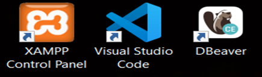


### Installation instructions

**Step 1: Clone the Repository**
First, open Command Prompt or Git Bash and navigate to the htdocs folder of XAMPP:
```shell
cd C:\xampp\htdocs
```
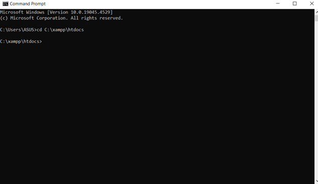

 Now clone the project repository:
git clone https://github.com/PhuNguyen93/c2310l_ProjectSem1_BeautyOfBeaches.git   

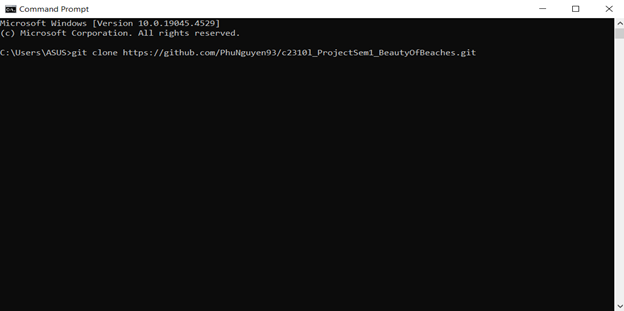

**Step 2: Install Dependencies**

Navigate into the project folder:
```shell
cd c2310l_ProjectSem1_BeautyOfBeaches
```
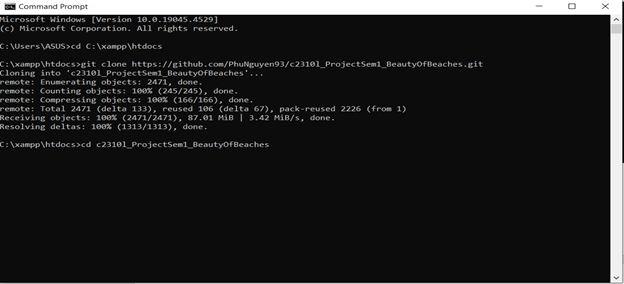

Install the required dependencies using Composer:
```shell
composer install
```
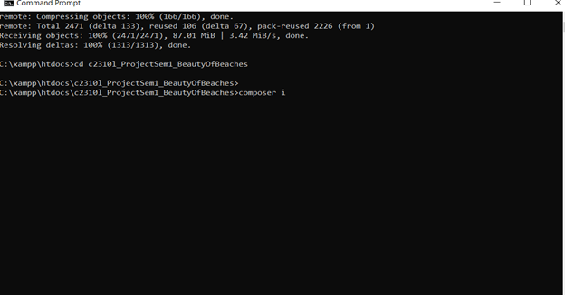


**Step 3: Set Up Environment Variables `.env`**

Create a copy of the .env.example file and name it .env:
```shell
cp.env.example.env
```
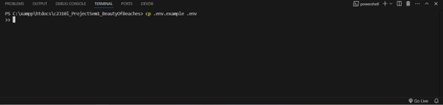

Open the .env file and configure the following variables based on your environment:

```shell
APP_NAME=BeautyOfBeaches
APP_ENV=local
APP_DEBUG=true
APP_URL=http://localhost

DB_CONNECTION=mysql
DB_HOST=127.0.0.1
DB_PORT=3306
DB_DATABASE=beach_db
DB_USERNAME=root
DB_PASSWORD=
DB_CHARSET=utf8mb4
DB_COLLATION=utf8mb4_unicode_ci

MAIL_MAILER=smtp
MAIL_HOST=smtp.gmail.com
MAIL_PORT=587
MAIL_USERNAME=your_email@gmail.com
MAIL_PASSWORD=your_email_password
MAIL_ENCRYPTION=tls
MAIL_FROM_ADDRESS=your_email@gmail.com
MAIL_FROM_NAME="Beauty Of Beaches"
```

Generate the application key:
```shell
php artisan key:generate
```
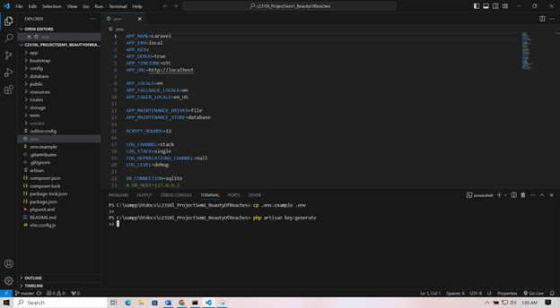
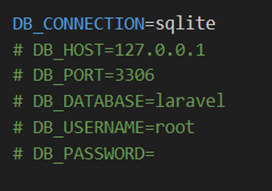
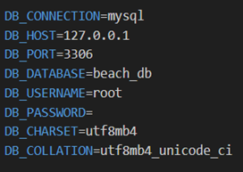
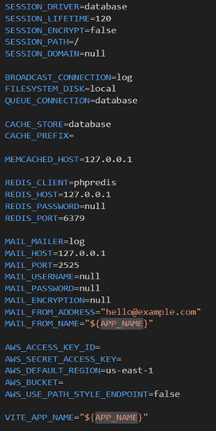
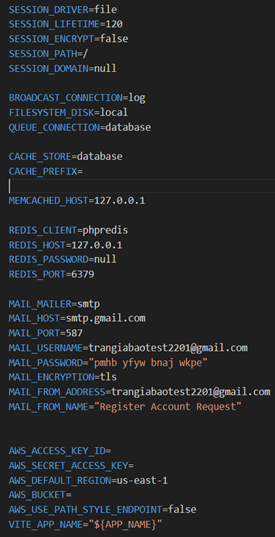

**Step 4: Set Up Database**

Open phpMyAdmin by visiting http://localhost/phpmyadmin/.
Create a new database named beach_db.
Import the database schema provided in the database folder of the project.
Alternatively, you can run migrations to create the tables:
```shell
php artisan migrate
```

**Step 5: Link Storage**
Run the following command to create a symbolic link between the public directory and storage:
```shell
php artisan storage:link
```
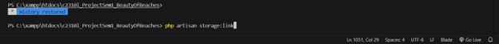

**Step 6: Serve the Application**
Finally, start the development server using:

```shell
php artisan serve
```

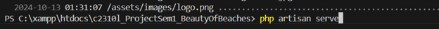

Open your browser and visit the project at http://127.0.0.1:8000.

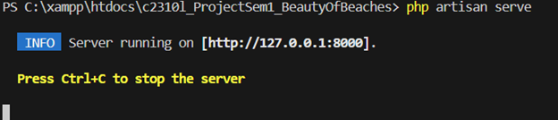

Features

Browse beaches based on country, direction, and other filters.
User authentication and OTP verification.
Reset password functionality via email.
Admin dashboard for managing users, beaches, and content.


Troubleshooting

If you encounter any issues, check the following:
Ensure XAMPP is running Apache and MySQL services.
Ensure your database credentials in the .env file are correct.
Make sure Composer dependencies are installed properly.
For further assistance, please contact the project maintainer.
